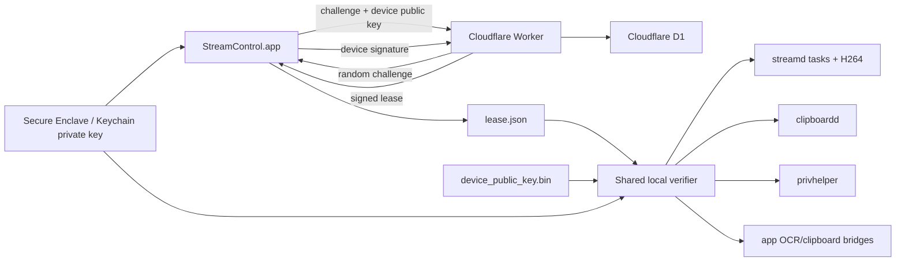

# TLinkauto License Security Design

## 1. Muc tieu va pham vi

Tai lieu nay mo ta co che license hien tai cua ban TrollStore, cac dam bao da co,
cac rui ro con lai, va danh sach ma nguon quan trong nen harden sau nay.

Muc tieu cua co che hien tai:

- License do Cloudflare Worker phat hanh va ky bang ECDSA P-256.
- Lease duoc rang buoc voi mot khoa rieng tren thiet bi.
- Sao chep rieng `lease.json` va public key sang may khac khong du de su dung.
- Moi process quan trong tu xac minh license, khong chi tin vao UI.
- Feature duoc phan quyen rieng: `automation`, `stream`, `script`, `admin`,
  `shell`.
- Cho phep hoat dong offline co gioi han bang `offline_until`.

Co che nay tang chi phi sao chep va crack thong thuong. No khong tao ra mot
security boundary tuyet doi tren thiet bi ma nguoi tan cong co quyen root,
co the attach debugger, hook ham, hoac patch binary.

Pham vi enforcement day du hien tai la `stream-app` TrollStore. Backend
rootfull cu (`pccontrol`, `tlinkauto-jsd` va app goc) chua duoc gate day du boi
shared verifier; day la mot khoang trong phai xu ly truoc khi mot license duoc
coi la bao ve dong thoi ca hai runtime.

## 2. Thanh phan

### Du lieu cuc bo

| Du lieu | Y nghia | Bi mat |
|---|---|---|
| `lease.json` | Payload, chu ky Worker va `key_id` | Khong |
| `device_public_key.bin` | Public point P-256 cua thiet bi | Khong |
| Private key trong Secure Enclave/Keychain | Chung minh dung thiet bi | Co |
| `device_key_hash` | SHA-256 cua public key thiet bi | Khong |
| `device_id` | ID ban ghi thiet bi trong D1 | Khong |
| `license_id` | ID license trong D1 | Khong |
| Worker signing private JWK | Ky lease hop le | Rat nhay cam |
| `ADMIN_TOKEN` | Quan ly license tren Worker | Rat nhay cam |

`key_id` la ID khoa ky cua Worker, khong phai ID thiet bi.

## 3. Luong hoat dong

### 3.1 Kich hoat

1. App tao khoa P-256. Uu tien Secure Enclave; neu that bai thi dung khoa
   Keychain software voi `ThisDeviceOnly`.
2. App gui license key va public JWK toi `/v1/challenge`.
3. Worker kiem tra license, tao challenge ngau nhien va luu challenge trong D1.
4. App ky challenge bang private key thiet bi.
5. `/v1/activate` xac minh chu ky, gioi han so thiet bi, va tao ban ghi device.
6. Worker ky lease chua `license_id`, `device_id`, `device_key_hash`, feature,
   `expires_at` va `offline_until`.
7. App luu lease atomically va local verifier kiem tra lai ngay.

### 3.2 Xac minh cuc bo

`TLinkLicenseStatusDictionary()` thuc hien:

1. Nap endpoint, server public key, `key_id` va enforcement config.
2. Doc va parse `lease.json`.
3. Xac minh version, product va `key_id`.
4. Xac minh chu ky ECDSA cua payload bang public key Worker duoc bundle san.
5. Bam `device_public_key.bin` va so sanh voi `device_key_hash` trong lease.
6. Lay private key tu Keychain, ky challenge cuc bo, sau do verify bang public
   key de chung minh private key van ton tai tren thiet bi.
7. Kiem tra `not_before`, `expires_at` va `offline_until`.
8. `TLinkLicenseFeatureAllowed()` kiem tra feature truoc khi cho phep thao tac.

Ket qua co cache toi da 5 giay trong tung process. Task `76` xoa cache cua
`streamd`; cac process khac co cache rieng.

### 3.3 Refresh va revoke

- Khi refresh, app ky payload lease hien tai bang device private key.
- Worker xac minh lease cu, trang thai license/device trong D1, va device
  signature truoc khi cap lease moi.
- Revoke tren server ngan refresh moi. Lease da ky van co the hoat dong den
  `offline_until`; hien tai chua co push revocation.

## 4. Enforcement hien tai

| Thanh phan | Diem chan |
|---|---|
| Task server `6000` | Gate trung tam truoc dispatch, map task sang feature |
| Legacy touch task `10` | Gate rieng vi la fire-and-forget |
| H264 `7001-7006` | Kiem tra feature `stream` khi accept client |
| Script runtime | Task/script feature gate trong `streamd` |
| Shell | Can feature `shell` va setting cuc bo duoc bat |
| Admin | Kill, clear data, respring can feature `admin` |
| `privhelper` | Tu verify license lai truoc lenh nhay cam |
| `clipboardd` | Tu verify feature `automation` |
| App-side OCR/clipboard | Tu verify feature `automation` |

Task chan doan `60`, `75`, `76`, `96`, `97`, `99` duoc mien gate de co the
chan doan va phuc hoi khi license loi. Du lieu tra ve tu cac task nay vi the
khong duoc chua secret.

Khi build production, `TLINK_LICENSE_ENFORCEMENT=true` phai dong thoi:

- Ghi `LicenseEnforcementEnabled=true` vao `LicenseConfig.plist`.
- Compile app, `streamd`, `clipboardd` va `privhelper` voi
  `TLINK_LICENSE_FORCE_ENFORCEMENT=1`.

Compile-time enforcement ngan viec chi sua plist de quay ve observe mode,
nhung van co the bi vo hieu hoa bang binary patch.

## 5. Dam bao da co

- Lease bi sua payload se hong chu ky Worker.
- Public key file bi thay se tao `license_device_key_mismatch`.
- Copy lease va public key sang may khac se thieu private key possession proof.
- Challenge activation co thoi han, rang buoc license va device key hash.
- Refresh can chu ky moi cua device private key.
- Worker khong luu license key dang ro; D1 chi luu hash.
- Private signing JWK va admin token duoc dat trong Worker secrets.
- Enforcement lap lai o nhieu process, giam rui ro chi patch mot UI check.
- Lease feature cho phep thu hoi rieng shell/admin/stream ma khong can tao
  binary khac.

## 6. Rui ro va backlog bao mat

### P0 - Can xu ly truoc production

#### 6.0 Rootfull chua co enforcement parity

Script API da duoc dong bo dan, nhung license gate chua duoc lap lai tai task
server, JS helper va privileged execution cua rootfull. Neu phat hanh cung goi,
nguoi dung co the chuyen sang backend khong gate.

Xu ly:

- Link shared verifier vao daemon/app/helper rootfull.
- Dung cung task-feature policy va response `license_required`.
- Gate tai privileged implementation, khong chi tai app UI.
- Them rootfull vao cung tamper/expiry/revoke regression matrix.
- Chi ap dung OLLVM sau khi gate rootfull da dung; obfuscate mot check UI don le
  khong mang lai gia tri bao mat.

#### 6.1 Lo signing key hoac admin token

Neu Worker private JWK bi lo, ke tan cong co the tu ky lease hop le. Neu
`ADMIN_TOKEN` bi lo, ho co the tao/revoke/reset license.

Xu ly:

- Rotate cap khoa test da tung duoc hien thi trong log/hoi thoai.
- Khong dua private JWK hoac admin token vao repo, app, artifact hay diagnostic.
- Tach token theo quyen, dat token co thoi han, va rotate dinh ky.
- Bat Cloudflare audit log/alert cho thay doi secret va deploy.
- Thiet ke key ring ho tro nhieu `key_id` de rotate ma khong khoa app cu.

#### 6.2 Binary patch va runtime hook

Ke tan cong co quyen cao co the patch `TLinkLicenseFeatureAllowed()` tra ve
true, sua nhanh dispatch, bo gate H264, hoac patch `privhelper`.

Xu ly:

- Lap gate tai diem thuc thi nhay cam, khong chi gate o socket/UI.
- OLLVM co chon loc cho verifier va cac gate liet ke o muc 8.
- Strip symbol, hidden visibility, giam ten ham noi bo de nhan dien.
- Them integrity telemetry/best-effort code hash, nhung khong coi self-check la
  security boundary vi no cung co the bi patch.
- Chuyen cac quyet dinh co gia tri cao ve server khi co the.

#### 6.3 Port automation chua xac thuc client

Port `6000` va H264 bind tren mang. License chi xac nhan thiet bi chay server
duoc phep; no chua xac nhan may tinh/client LAN nao duoc quyen dieu khien.
Mot client cung Wi-Fi co the thu gui task neu truy cap duoc port.

Xu ly:

- Pair client bang QR/one-time code.
- Tao session key rieng va HMAC moi request voi nonce/counter chong replay.
- H264 can handshake token truoc khi gui frame.
- Co tuy chon bind loopback/USB hoac allowlist subnet/client.
- Khong dung license key lam session password.

#### 6.4 Rate limit, brute force va admin API

Worker chua co rate limit ro rang cho challenge/activate/admin. License key hash
la SHA-256 khong salt; neu D1 bi lo va key yeu, co the dictionary attack offline.

Xu ly:

- License key production phai ngau nhien toi thieu 128 bit.
- Dung HMAC-SHA-256 voi server-side pepper thay cho hash thuan khi lookup key.
- Them Cloudflare rate limiting theo IP, license hash va device key hash.
- Them body-size limit, schema validation va gioi han do dai moi field.
- Bao ve admin route bang Access/mTLS hoac service token rieng, khong chi mot
  bearer token dai han.

### P1 - Nen xu ly sau MVP

#### 6.5 Cua so offline sau revoke

Revoke khong vo hieu lease da ky ngay; client co the hoat dong toi
`offline_until`.

Xu ly: rut ngan grace cho feature nhay cam, yeu cau online check dinh ky cho
`admin`/`shell`, va them signed revocation epoch/version vao lease.

#### 6.6 Lui dong ho he thong

Verifier dung wall clock cua thiet bi. Nguoi co quyen cao co the thu lui gio de
keo dai lease.

Xu ly: luu moc server time da ky va monotonic uptime, tu choi rollback lon, va
bat online refresh khi phat hien clock anomaly.

#### 6.7 Secure Enclave fallback

Neu Secure Enclave that bai, app dung software Keychain key. `ThisDeviceOnly`
giam sao chep backup, nhung tren thiet bi da bi khai thac, software key co muc
bao ve thap hon Secure Enclave.

Xu ly: Worker luu va danh dau `device_key_mode`; co the cam feature nhay cam
tren software fallback hoac yeu cau re-enroll.

#### 6.8 Gate bi bo sot khi them task moi

Task moi mac dinh dang map vao `automation`. Mot task admin moi co the vo tinh
nhan sai feature; mot port/bridge moi co the khong qua gate trung tam.

Xu ly: dung bang metadata duy nhat `task -> feature -> risk`, test moi task,
va lam CI fail neu task duoc dispatch ma khong co policy.

#### 6.9 Cache va enforcement khong dong bo

Moi process cache toi da 5 giay. Sua lease/revoke cuc bo co the khong co hieu
luc cung luc tren `streamd`, `clipboardd`, app va helper.

Xu ly: Darwin notification khi lease thay doi, cache generation file, va xoa
cache o moi process truoc thao tac admin.

#### 6.10 Challenge race va du lieu cu

Challenge duoc xoa sau activation nhung chua co transaction consume atomic;
challenge het han cung chua duoc don dinh ky.

Xu ly: atomic consume/transaction, unique consumed state, scheduled cleanup,
va gioi han so challenge dang mo tren mot license/device/IP.

#### 6.11 Key rotation chua hoan chinh

Client hien pin mot `key_id` va mot public key. Rotate dot ngot co the lam app
cu khong refresh/verify duoc.

Xu ly: bundle primary + backup public key, lease co `key_id`, thoi gian overlap,
va quy trinh thu hoi khoa cu co audit.

### P2 - Hardening bo sung

- Certificate/public-key pinning sau khi co custom hostname va backup pin.
- Obfuscation da dang theo tung build, kem symbol map noi bo.
- Anti-debug/hook telemetry best effort; khong khoa nham thiet bi that.
- Audit event cho create, activate, refresh, revoke, reset va anomaly.
- Gioi han CORS thay vi `Access-Control-Allow-Origin: *` neu khong can browser.
- Giam thong tin task chan doan cong khai: path, PID, device/license ID.
- Them dependency pinning/SBOM cho Worker, Theos va static libraries.

## 7. Thong tin khong can che giau

Khong ton cong obfuscate cac gia tri sau:

- Worker public key X/Y.
- `key_id`, endpoint, `device_id`, `device_key_hash`, `license_id`.
- Format lease va thuat toan ECDSA.

Bao mat phai dua vao private signing key, device private key, server policy va
enforcement; khong dua vao viec giu bi mat thuat toan.

## 8. Ma nguon quan trong can bao ve

### Tier A - Uu tien OLLVM/hardening cao nhat

| File | Ham/khu vuc | Ly do |
|---|---|---|
| `shared/TLinkLicenseVerifier.mm` | `TLinkLicenseConfiguredEnforcement` | Quyet dinh enforced hay observe |
| `shared/TLinkLicenseVerifier.mm` | `TLinkCreateServerPublicKey` va verify ECDSA trong `TLinkLicenseStatusDictionary` | Goc tin cay chu ky Worker |
| `shared/TLinkLicenseVerifier.mm` | `TLinkVerifyDeviceKeyPossession` | Rang buoc private key thiet bi |
| `shared/TLinkLicenseVerifier.mm` | So sanh `device_key_hash`, product, version, dates | Ngan copy/tamper/replay lease |
| `shared/TLinkLicenseVerifier.mm` | `TLinkLicenseFeatureAllowed` | Diem allow/deny dung chung |
| `stream-app/streamd/POCSocketServer.mm` | `TLinkLicenseTaskIsExempt` | Danh sach task co the bo qua gate |
| `stream-app/streamd/POCSocketServer.mm` | `TLinkLicenseFeatureForTask` | Map task sang quyen |
| `stream-app/streamd/POCSocketServer.mm` | Gate dau `TLinkHandleTaskLine` va gate task `10` | Chan automation chinh |
| `stream-app/streamd/H264Stream.mm` | Gate khi `accept()` | Chan stream khong license |
| `stream-app/privhelper/main.mm` | `TLinkHelperRequireLicense` va command dispatch trong `main` | Bao ve lenh root/admin |
| `stream-app/clipboardd/main.mm` | Gate trong `TLinkClipboardHandleLine` | Bao ve clipboard daemon |
| `stream-app/app/AppDelegate.mm` | Gate app-side OCR/clipboard bridge | Tranh bypass qua app port |

### Tier B - Bao ve activation va refresh

| File | Ham/khu vuc | Ly do |
|---|---|---|
| `stream-app/app/LicenseManager.mm` | Tao/tim device private key | Danh tinh thiet bi |
| `stream-app/app/LicenseManager.mm` | `devicePublicJWKForPrivateKey` | Tao public binding dung format |
| `stream-app/app/LicenseManager.mm` | `activateLicenseKey` | Challenge-response activation |
| `stream-app/app/LicenseManager.mm` | `refreshLeaseWithCompletion` | Chung minh device khi refresh |
| `stream-app/app/LicenseManager.mm` | `saveLease` | Ghi lease atomically va invalidate cache |
| `stream-app/app/StreamSupervisor.mm` | Version/path replacement | Ngan daemon cu bo qua policy moi |
| `.github/workflows/stream-app.yml` | Ep `TLINK_LICENSE_FORCE_ENFORCEMENT` | Bao dam release khong build observe |

### Rootfull - Can tich hop verifier truoc khi OLLVM

| File | Khu vuc can gate/harden |
|---|---|
| `pccontrol/SocketResponder.xm` va `pccontrol/Task.xm` | Task dispatch va task-feature policy rootfull |
| `pccontrol/TLinkautoJSRuntime.mm` | API script co the goi automation/admin/shell |
| `pccontrol/jsruntime/TLinkJSRuntimeCore.mm` | Lifecycle va native bridge cua script |
| `tlinkauto-jsd/TLinkJSHelperServer.mm` | Helper protocol va file/native operations |
| `TLinkauto/TLinkauto/Socket.m` | UI socket client/status; khong duoc la diem gate duy nhat |

Sau khi tich hop, cac gate rootfull nay thuoc Tier A. Ten selector Logos,
Objective-C runtime va IPC protocol phai duoc exclude khoi rename neu OLLVM
lam hong lookup dong.

### Worker - Khong dung OLLVM

Worker la JavaScript chay phia Cloudflare; OLLVM khong ap dung. Can bao ve bang
secret management, access policy, rate limit, audit va server-side validation.
Khu vuc nhay cam:

- `signingKeys`, `signPayload`, `verifyLease`.
- `handleChallenge`, `handleActivate`, `handleRefresh`.
- `requireAdmin` va cac admin handler.
- D1 schema/status transitions va device limit.

## 9. Chien luoc OLLVM de xuat

Khong nen bat flattening/bogus-control-flow/string-encryption cho toan bo app.
UIKit, Objective-C runtime, Vision, Tesseract va private framework bridge de bi
loi neu obfuscation qua rong.

De xuat:

1. Tach shared verifier thanh static library/module rieng.
2. Dat hidden visibility cho ham noi bo; chi export API can thiet.
3. Strip release symbols, giu symbol map rieng cho crash analysis.
4. Bat string encryption cho error/policy string nhay cam, khong can ma hoa
   public key hoac endpoint.
5. Bat control-flow flattening/substitution cho Tier A truoc, benchmark startup,
   task latency, pin, OCR va crash rate.
6. Obfuscate tung process (`streamd`, app, `clipboardd`, `privhelper`) voi seed
   khac nhau de mot patch khong ap dung dong loat.
7. Khong rename Objective-C selector duoc goi bang `NSSelectorFromString`, KVC,
   storyboard/runtime, hoac private framework.
8. Khong obfuscate C entry point, exported cross-translation-unit symbol, wire
   protocol constant, entitlement key, bundle ID va TSRootBinaries name.
9. CI phai build ca ban thuong va ban OLLVM, chay cung regression matrix.

OLLVM chi lam reverse engineering kho hon. No khong thay the rate limiting,
client authentication, server revocation, key rotation hay secret hygiene.

## 10. Regression matrix bat buoc

- Valid lease: moi feature duoc cap hoat dong.
- Missing lease: task/stream/helper/bridge bi deny khi enforcement bat.
- Payload hoac signature bi sua: `license_signature_invalid`.
- Public key file bi thay: `device_mismatch`.
- Private key bi mat: device possession proof that bai.
- Sai `key_id`, product, version, `not_before`, `offline_until`: deny ro rang.
- Feature thieu: chi feature do bi deny.
- Revoke/reset: refresh that bai; lease offline het han dung thoi diem.
- App reinstall: daemon cu bi thay, moi process van nap config current bundle.
- H264, clipboardd, app bridge va privhelper khong bypass duoc task-server gate.
- Build production bao `enforcement_enabled=true` trong app va moi process.
- OLLVM build cho ket qua protocol giong build thuong.

## 11. Thu tu trien khai de xuat

Ke hoach dong chuc nang license TrollStore, voi rootfull va OLLVM duoc tam
hoan den sau release gate, nam tai
[`license-trollstore-completion-plan.md`](license-trollstore-completion-plan.md).

1. Rotate signing key test va `ADMIN_TOKEN` truoc khi production.
2. Them client pairing + session authentication cho port 6000/H264.
3. Them Worker rate limit, admin access policy va audit event.
4. Them signed revocation epoch va clock rollback detection.
5. Hoan thien key rotation voi primary/backup key.
6. Chuyen task policy sang bang metadata co regression test.
7. Sau khi behavior on dinh, ap dung OLLVM co chon loc cho Tier A, roi Tier B.
